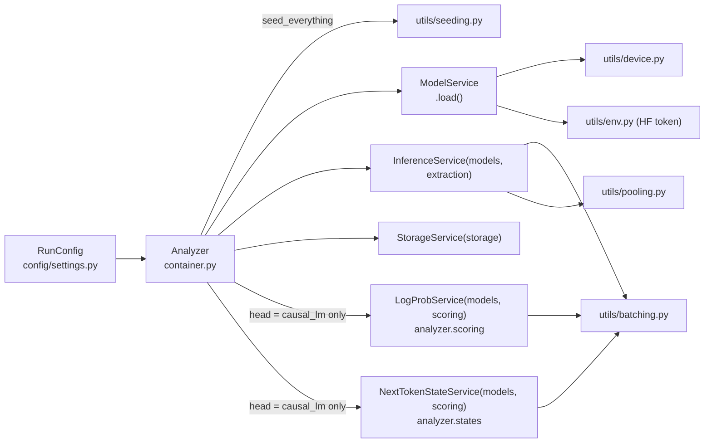
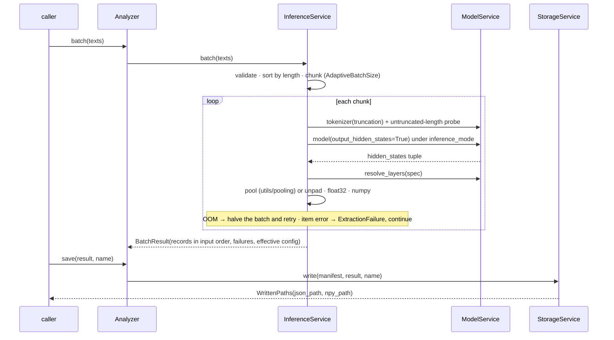

# Services and request flows

This page is the map a maintainer needs: what the services are, the contracts between
them, how `Analyzer` wires them, and what a request looks like on each path. The
per-file responsibility tree lives in [Architecture](../architecture.md) and is enforced
by a test.

## In one paragraph

The package is an **in-process microservice pipeline**: separately owned services with
narrow contracts, wired in one place (`container.Analyzer`), running in one process.
Each service depends only on the `typing.Protocol`s in `services/interfaces.py`, never on
another service's class, so a fake provider is enough to unit-test a service and any of
them could move behind HTTP by writing a client that satisfies the same Protocol. The
experiments sit on top of two of those seams (`SequenceScorer`, `StateProvider`) plus the
model provider for sampling.

## The contracts

| Protocol (`services/interfaces.py`) | Implemented by | Consumed by |
|---|---|---|
| `ModelProvider`: `model`, `tokenizer`, `num_hidden_layers`, `hidden_size`, `device`, `load()`, `resolve_layers(spec)`, `effective_max_length()`, `metadata()` | `services/model_service.ModelService` | every other service; `experiments/decoding.py` as the sampler's provider |
| `InferenceEngine`: `invoke(text)`, `batch(texts)` | `services/inference_service.InferenceService` | `Analyzer.invoke / batch / run` |
| `SequenceScorer`: `score(texts) -> ScoreResult` | `services/scoring_service.LogProbService`; `testing.FakeSpanScorer` in tests | Task 1b (`span_costs.compute_span_costs`) |
| `StateProvider`: `vocab_size`, `encode`, `encode_with_offsets`, `decode`, `states(sequences, positions)` | `services/state_service.NextTokenStateService` | Tasks 9a and 9b |
| `ResultSink`: `write(manifest, result, name)` | `services/storage_service.StorageService` | `Analyzer.save` |

The data that crosses these seams is defined once in `domain/records.py`
(`ExtractionRecord`, `LayerState`, `BatchResult`, `SentenceScore`, `ScoreResult`,
`StateResult`, `RunManifest`, `WrittenPaths`) and holds numpy, never torch, so a result
needs no CUDA context to read.

## Wiring

`Analyzer(config)` builds every service from one `RunConfig`, loads the model once and
owns it for the session. Any service can be injected (`Analyzer(storage_service=...)`).
Constructors: `Analyzer.quick(model_id, layers=...)` for extraction,
`Analyzer.for_scoring(model_id)` for the experiments (loads the LM head). `unload()`
frees the model and clears caches so a Colab cell can be re-run.

## Request flows

### Extraction: `analyzer.batch(texts)`

### Scoring: `analyzer.score(texts)` (Task 1b)

`LogProbService.score` prepends one BOS token by hand (`bos_policy="auto"`: BOS, else
EOS), pads on the right, runs the LM head, and computes each token's log-probability as
`gather - logsumexp` in float32 (never a full `log_softmax` over a 150k vocabulary). It
returns per-sentence `sum_logprob`, `n_tokens`, `mean_logprob` and, on request, the
per-token vector. Non-finite scores are recorded as failures. `calibrate_batch_size`
probes the GPU with the longest texts and hands the result to the same
`AdaptiveBatchSize` that inference uses.

### Next-token states: `analyzer.states.states(sequences, positions)` (Tasks 9a, 9b)

`NextTokenStateService` takes token **ids**, not text, so the splice alignment
`i+1+k <-> j+1+k` is exact. For each requested position it returns the float32
log-softmax over the vocabulary of the token after it; with `return_token_logprobs=True`
it also returns every predicted token's log-probability, which is where Task 9a's
`surprisal` and Task 9b's `lp_orig` come from. `encode_with_offsets` exposes the
tokenizer's character offsets for the boundary mapping.

### Generation: `decoding.sample_continuations(provider, context, ...)` (Task 9b)

`experiments/decoding.py` runs its own sampling loop on `ModelService.model`: all `K`
rows are drawn together from a per-call `torch.Generator`, so two calls with one seed
are paired; EOS is an ordinary token; every sample has exactly `L` ids; the KV cache is
used, with a re-feed-everything oracle for tests. The global RNGs are never touched.

## Module map

### `services/`

| Module | Owns | Never does |
|---|---|---|
| `model_service.py` | Loading (the only `transformers` loading call site), head choice, device and dtype, HF token, pad-token fallback, architecture rejection, multimodal text-only mode, layer-spec resolution, context length, provenance | Run a forward pass for a caller |
| `inference_service.py` | Hidden-state extraction: batching, OOM halving, failure isolation, truncation flag, layer picking, pooling | Touch the file system |
| `scoring_service.py` | Sentence log-probabilities | Hold experiment logic |
| `state_service.py` | Next-token log-softmax vectors and per-token log-probabilities from ids | Split sentences or choose cuts |
| `storage_service.py` | Atomic JSON writes, rounding, sidecar policy, `load_run` | Know what a record means |

### `experiments/`

| Module | Task | Owns |
|---|---|---|
| `jsonl_cache.py` | all | Resumable JSONL: read with truncated-line repair, header check naming the differing field, atomic rewrite, fsynced append, Drive mirror |
| `stats.py` | 1b | `bootstrap_ci`, `paired_bootstrap_diff`, `trapezoid_area` |
| `experiment_figures.py` | all | The runbook's figure module, vendored: `fig_<task>(record, path)` and `mock_<task>` data for 17 tasks |
| `treebank.py`, `spans.py`, `proforms.py`, `span_costs.py`, `task_1b.py` | 1b | Gold trees and detokenisation; span algebra and induction; replacement policies; phase A cache; phase B analysis |
| `boundaries.py`, `paragraphs.py`, `splice.py`, `task_9a.py` | 9a | Boundary positions; the corpus; phase A cuts, states and cache; phase B labels, audit, test, record |
| `decoding.py`, `task_9b.py` | 9b | Generation primitives; the per-cut driver, cache, record and invariants |

### `utils/`

| Module | Owns |
|---|---|
| `batching.py` | `AdaptiveBatchSize` (sticky halving, growth after clean batches, ceiling below any size that ran out of memory), `chunk`, `maybe_progress`, `run_with_oom_halving` |
| `device.py` | Device and dtype auto-selection (bf16 only when native), `describe_device` |
| `pooling.py` | Mask-aware `last_token` / `mean` / `cls` pooling and `unpad_sequence`; padding-side agnostic |
| `env.py` | Secret resolution Colab userdata → env var → `None`; `in_colab`; `redact` |
| `seeding.py` | `seed_everything`, optional strict determinism |
| `logging.py` | One idempotent handler on the package logger |

## Conventions that hold everywhere

- **Validation at construction**: bad settings fail in the config dataclasses'
  `__post_init__`, not mid-forward-pass.
- **Failures are data**: one bad item becomes an `ExtractionFailure` or a counted failed
  variant; a run is never killed by one input.
- **OOM halves the batch**, remembers the ceiling, and grows back after clean batches.
- **Numpy leaves the device in float32**, whatever dtype the model ran in.
- **Everything that changes a number is recorded** in the output: resolved layers, the
  effective configuration and its fingerprint, the pre-registration header of every
  cache, library versions.
- **Secrets never reach the disk**: the HF and GitHub tokens are resolved at use, redacted
  from logs, stripped from `to_dict()`, and scrubbed from `.git/config` after cloning.
