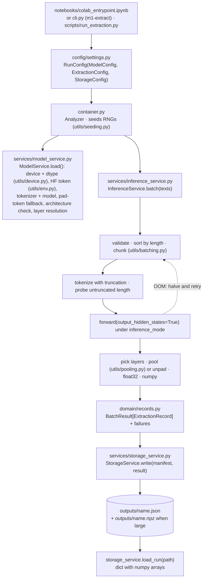

# Hidden-state extraction

## What it does

Load an open-source Hugging Face model, run some texts through it, keep the hidden states
of the layers you asked for (pooled to one vector per text, or per token), and save them
as a self-describing JSON file that can be read back as numpy arrays. This is the base
pipeline the experiments were built on, and the one `colab_entrypoint.ipynb` runs.

## Data and how it is collected

The texts are yours. Three ways in:

| Entry point | Where the texts come from |
|---|---|
| `notebooks/colab_entrypoint.ipynb` | The `INPUTS` list and `PROMPT` in the configuration cell |
| `m1-extract` / `python scripts/run_extraction.py` | `--text` (repeatable) or `--input-file`: one text per line, a JSON array of strings, or JSONL with a `text` key (`cli.read_inputs`) |
| Python | `analyzer.invoke(text)`, `analyzer.batch(texts)` |

Empty and whitespace-only inputs are rejected. The texts travel inside the output file
unless `StorageConfig(include_input_text=False)`.

## Pipeline



## Files used

| File | Role | Key names |
|---|---|---|
| `notebooks/colab_entrypoint.ipynb` | Driver: bootstrap, smoke test, `invoke`, `batch`, save, reload, extras | |
| `src/m1_analyzer/cli.py`, `scripts/run_extraction.py` | The same pipeline from a terminal | `build_parser`, `parse_layers`, `read_inputs`, `main` |
| `src/m1_analyzer/config/settings.py` | Validated configuration dataclasses | `ModelConfig`, `ExtractionConfig`, `StorageConfig`, `RunConfig.fingerprint` |
| `src/m1_analyzer/container.py` | Facade and wiring; owns the loaded model | `Analyzer.quick`, `invoke`, `batch`, `save`, `run`, `describe`, `unload` |
| `src/m1_analyzer/services/model_service.py` | The only module that calls `transformers` loading APIs | `ModelService.load`, `resolve_layers`, `effective_max_length`, `metadata` |
| `src/m1_analyzer/services/inference_service.py` | The forward pass, batching, pooling, failure isolation | `InferenceService.invoke`, `batch` |
| `src/m1_analyzer/services/storage_service.py` | Atomic JSON writer, rounding, `.npz` sidecar, reader | `StorageService.write`, `load_run` |
| `src/m1_analyzer/domain/records.py` | What services exchange (numpy, never torch) | `ExtractionRecord`, `LayerState`, `BatchResult`, `RunManifest`, `make_item_id` |
| `src/m1_analyzer/utils/` | Device and dtype choice, adaptive batch size, pooling math, secrets, seeding, logging | `device.py`, `batching.py`, `pooling.py`, `env.py`, `seeding.py`, `logging.py` |
| `scripts/smoke_test.py` | End-to-end check; `--offline` builds a tiny model instead of downloading one | |

## Outputs

| File | Format | Holds |
|---|---|---|
| `outputs/<name>.json` | JSON, `schema_version 1.0` | `run` (model id, revision, device, dtype, requested and resolved layers, the layer-index convention, pooling, max length, seed, library versions, config fingerprint), `counts`, `storage`, `records[]` (`id = sha256(text)[:16]`, `text`, token counts, `truncated`, `layers{label: {index, requested, shape, values | npy_ref}}`), `failures[]` |
| `outputs/<name>.npz` | numpy archive | The float32 arrays when the run exceeds `npy_threshold_floats` (1M by default); `values` is then `null` and `npy_ref` points here. Keep the two files together |

Floats are rounded to `float_precision` decimals in JSON (6 by default); the sidecar is
lossless. `load_run` stitches the two back into one dict of numpy arrays.

## Worked example

!!! note "Illustrative, not a result"
    Written by `scripts/make_doc_examples.py` on the random 4-layer, hidden-size-16 GPT-2
    from `m1_analyzer.testing`, so vectors have 16 entries (four shown). The README shows
    the same schema annotated for a real model.

=== "Output file"

    ```json
    --8<-- "docs/assets/examples/extraction_tiny.json"
    ```

=== "Python"

    ```python
    from m1_analyzer import Analyzer, load_run

    analyzer = Analyzer.quick("Qwen/Qwen2.5-0.5B-Instruct", layers=[-1, "middle"])
    record = analyzer.invoke("The capital of France is Paris.")
    record.layer(-1).shape          # (hidden_size,)
    result = analyzer.batch(["one", "two", "three"])
    paths = analyzer.save(result, name="my_run")

    run = load_run(paths.json_path)
    run["records"][0]["layers"]["-1"]["values"]   # np.ndarray
    ```

=== "Terminal"

    ```bash
    python scripts/run_extraction.py \
      --model Qwen/Qwen2.5-0.5B-Instruct \
      --layers=-1,middle --pooling last_token \
      --input-file prompts.txt --out outputs/run.json
    ```

    Note the `=` in `--layers=-1`: argparse would read a bare `-1` as a flag.

## Configuration knobs

| Setting | Default | Meaning |
|---|---|---|
| `ModelConfig.model_id`, `revision` | | Hub id or local path; pin a commit SHA for reproducibility |
| `device`, `dtype` | `auto` | `cuda` / `mps` / `cpu`; bf16 only where native, else fp16 on GPU, fp32 on CPU |
| `head` | `base` | `base` (hidden states) or `causal_lm` (adds `score`, `next_token_states`) |
| `trust_remote_code` | `False` | Opt in per model; it executes repo code |
| `ExtractionConfig.layers` | `-1` | int, list, `"all"`, `"last"`, `"middle"`; index 0 is the embedding output |
| `pooling` | `last_token` | `last_token`, `mean`, `cls`, `none` (per token) |
| `max_length`, `max_length_cap` | `None`, 4096 | model context, capped |
| `batch_size` | 8 | halves on GPU OOM and remembers it |
| `continue_on_error` | `True` | record failures instead of raising |
| `StorageConfig.output_dir`, `float_precision`, `npy_mode`, `include_input_text` | `outputs`, 6, `auto`, `True` | where and how to write |
| `RunConfig.seed` | 42 | python, numpy and torch RNGs |

## Layer indexing

`hidden_states` has `num_hidden_layers + 1` entries: index 0 is the embedding output,
`1 … N` the output of block *i*, `-1` the same as `N`. `"middle"` resolves to `N // 2`.
Every output file records both the label you asked for and the resolved absolute index.

## Where to look next

- Notebook: [`notebooks/colab_entrypoint.ipynb`](https://github.com/SalmonSung/m1_llms_analyzer/blob/main/notebooks/colab_entrypoint.ipynb)
- Architecture flow: [How a run flows](../architecture.md#how-a-run-flows)
- Design decisions: [Model loading](../design_decisions.md#model-loading), [Inference](../design_decisions.md#inference), [Storage](../design_decisions.md#storage)
- Edge cases: [Handled](../edge_cases.md#handled)
- Tests: `tests/test_inference.py`, `tests/test_pooling.py`, `tests/test_layer_selection.py`, `tests/test_storage.py`, `tests/test_config.py`
