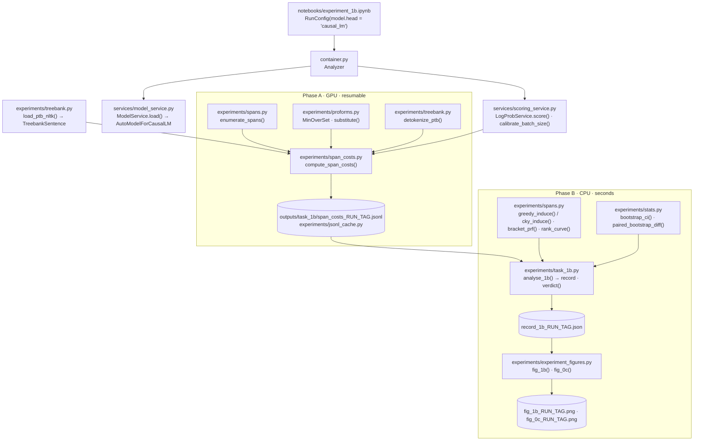
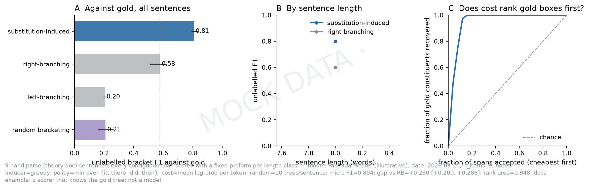
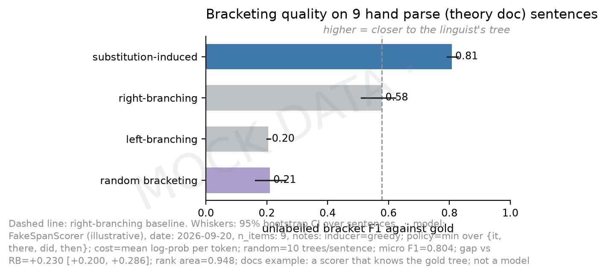
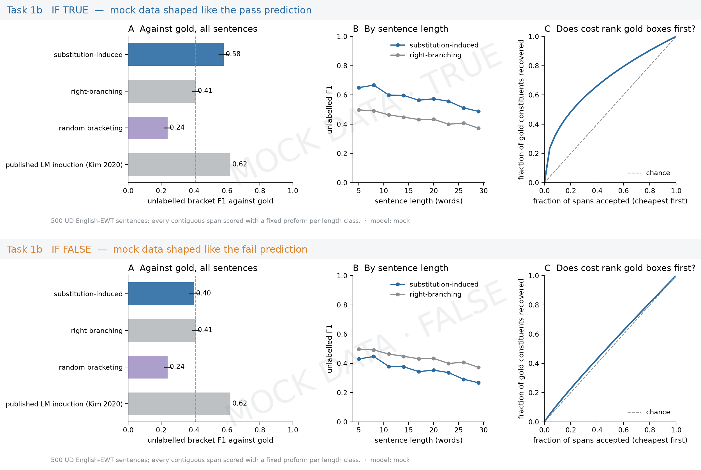

# Task 1b: does substitution *find* constituents?

## The question

Replace a span of a sentence with a short stand-in (a *proform*: `it`, `there`, `did`,
`then`, `do so`, ...) and ask the model how much less likely the sentence became. If that
cost is low where the gold parse has a constituent and high where a span straddles two
constituents, then substitution cost *finds* constituents rather than merely confirming
ones we name. The test: induce a bracketing per sentence from the costs alone (cheapest
span first, never cross a kept span), score it against the treebank's gold brackets with
unlabelled F1, and compare with trees that know nothing about the sentence
(right-branching, left-branching, random). **Pass**: the induced trees beat both
right- and left-branching by their paired-bootstrap intervals.

## Data and how it is collected

- **Source**: the free NLTK Penn Treebank sample, 10 % of the Wall Street Journal
  portion, 3 914 sentences with hand-annotated constituency trees. Fetched once by
  `treebank.ensure_nltk_treebank`, which calls `nltk.download("treebank")`.
- **Selection**: `treebank.load_ptb_nltk(n=1000, min_len=5, max_len=30, seed=42)` draws
  a seeded sample of the eligible sentences and returns them in corpus order as
  `TreebankSentence(words, text, gold_spans)`.
- **Gold conventions** (recorded in every cache header): traces and punctuation removed
  together with any node they empty, unaries collapsed (gold is a set), labels dropped,
  single words and the whole sentence excluded. These are the unsupervised-parsing
  literature's conventions; see the [design decision](../design_decisions.md#experiments-task-1b).
- **Text the model reads**: PTB tokens are detokenised by `treebank.detokenize_ptb`
  (`-LRB-` → `(`, `n't` re-attached, and so on).
- **The answer key travels with the data**: each cache row also stores the sentence's
  words, gold spans, source and bracketed tree, so phase B can run on a machine that has
  never installed the treebank.

```text
--8<-- "docs/assets/examples/detokenize.txt"
```

## Pipeline



Phase A scores every span × every variant of every sentence on the GPU and caches the raw
numbers. Phase B is pure CPU arithmetic over the cache, so a different inducer,
normalisation or proform subset is a re-run of seconds without touching the model.

## Files used

| File | Role in this task | Key functions |
|---|---|---|
| `notebooks/experiment_1b.ipynb` | Driver: configuration, smoke test, phases A and B, figures, save, Drive | cells 8, 18, 20, 22, 24 |
| `src/m1_analyzer/container.py` | Loads the model once with its LM head and exposes scoring | `Analyzer`, `Analyzer.for_scoring` |
| `src/m1_analyzer/services/scoring_service.py` | Text → sentence log-probability (sum, mean per token); BOS prepended; OOM-safe | `LogProbService.score`, `calibrate_batch_size` |
| `src/m1_analyzer/experiments/treebank.py` | Treebank loading, gold spans from trees, detokenisation, hand examples | `load_ptb_nltk`, `gold_spans_from_tree`, `detokenize_ptb`, `theory_example` |
| `src/m1_analyzer/experiments/spans.py` | Span algebra and induction | `enumerate_spans`, `crosses`, `greedy_induce`, `cky_induce`, `bracket_prf`, `rank_curve`, `right_branching` |
| `src/m1_analyzer/experiments/proforms.py` | Replacement policies and the substitution itself | `MinOverSet`, `ByLengthClass`, `parse_policy`, `substitute`, `DELETION` |
| `src/m1_analyzer/experiments/span_costs.py` | Phase A: score every variant, cache with the answer key embedded | `compute_span_costs`, `SpanCostTable`, `load_span_costs_with_gold` |
| `src/m1_analyzer/experiments/jsonl_cache.py` | Resumable JSONL mechanics shared by all tasks | `write_header`, `check_header`, `append_row`, `read_jsonl`, `mirror` |
| `src/m1_analyzer/experiments/task_1b.py` | Phase B: induce, score against gold, bootstrap, verdict | `analyse_1b`, `evaluate_sentence`, `validate_record`, `verdict`, `run_task_1b` |
| `src/m1_analyzer/experiments/stats.py` | Bootstrap intervals and the rank-curve area | `bootstrap_ci`, `paired_bootstrap_diff`, `trapezoid_area` |
| `src/m1_analyzer/experiments/experiment_figures.py` | The figures the record feeds | `fig_1b`, `fig_0c` |
| `src/m1_analyzer/testing.py` | Offline stand-in for the scorer in tests and these docs | `FakeSpanScorer` |

## Outputs

All under `outputs/task_1b/`, with `RUN_TAG = slug(MODEL_ID)_slug(POLICY.name)`.

| File | Format | One line / record holds |
|---|---|---|
| `span_costs_<RUN_TAG>.jsonl` | JSONL: one header line, then one line per sentence | Header: policy, proforms and controls, gold conventions, model id. Row: `words`, `text`, `base = [sum_logprob, n_tokens]`, `spans[proform]["i,j"] = [sum_logprob, n_tokens]`, `failed`, plus `gold_spans`, `source`, `info`, and the bracketed `tree` when `INCLUDE_TREES` |
| `record_1b_<RUN_TAG>.json` | JSON, the `fig_1b` schema | `n_sentences`, `treebank`, `methods[{name, f1, ci}]`, `by_length[{len, n, f1_sub, f1_rb}]`, `rank_curve[{frac_spans, recall_gold}]`, `meta`, `diagnostics` (micro F1, gaps vs baselines, rank area, per-sentence rows) |
| `fig_1b_<RUN_TAG>.png`, `fig_0c_<RUN_TAG>.png` | PNG | Panel A F1 bars with bootstrap whiskers, B F1 by sentence length, C the rank curve |
| `smoke_*` | same | The smoke test's copies on the tiny model |

Raw sums are cached, not costs: `cost = base_sum/base_n - sum/n` (mean normalisation) or
`base_sum - sum` (sum normalisation) is derived on read, so either normalisation is a
phase-B choice.

## Worked example

!!! note "Illustrative, not a result"
    Everything below was produced by `scripts/make_doc_examples.py` from the repo's hand
    fixtures with `FakeSpanScorer`, a scorer that knows the gold tree (gold spans cheap,
    crossing spans dear, seeded noise). It shows the *shape* of every intermediate and
    output; the numbers say nothing about any model. No real results are stored in
    this repository. Long lists are cut to four items followed by `"..."`.

=== "Input"

    The theory document's sentence and its seven gold spans, as `treebank.theory_example()` returns them:

    ```json
    --8<-- "docs/assets/examples/theory_example.json"
    ```

    ```text
    --8<-- "docs/assets/examples/spans_basics.txt"
    ```

=== "Substitution"

    What `proforms.substitute` sends to the scorer for a few spans, including the two controls
    (`blorp`, a nonsense word, and `<del>`, deletion). Position 0 is re-capitalised.

    ```text
    --8<-- "docs/assets/examples/substitute.txt"
    ```

=== "Induction"

    Phase B in slow motion: `SpanCostTable.costs_for(policy)` reduces the cache to one cost
    per span, `spans.greedy_induce` walks them cheapest first and keeps every span that
    crosses nothing already kept, `bracket_prf` scores the result against gold.

    ```text
    --8<-- "docs/assets/examples/induce_trace.txt"
    ```

=== "Cache row"

    The header line and the first sentence line of a `span_costs_*.jsonl`, with the answer
    key embedded (three spans per proform shown):

    ```json
    --8<-- "docs/assets/examples/span_costs_header.json"
    ```

    ```json
    --8<-- "docs/assets/examples/span_costs_row.json"
    ```

=== "Record"

    `analyse_1b` on nine hand sentences (six copies of one, so `by_length` has a row), then
    `verdict(record)`:

    ```json
    --8<-- "docs/assets/examples/record_1b.json"
    ```

    ```text
    --8<-- "docs/assets/examples/verdict_1b.txt"
    ```

=== "Figures"

    `fig_1b` drawn from that record (watermarked as mock):

    

    `fig_0c` from the same record:

    

    What the runbook expects a pass and a fail to look like (`experiment_figures.mock_1b`):

    

## Configuration knobs

Set in the notebook's *Configuration* cell; the right-hand column is where each one lands.

| Notebook field | Default | Reaches |
|---|---|---|
| `MODEL_ID` | `Qwen/Qwen3-0.6B-Base` | `ModelConfig(model_id, head="causal_lm")`. Use a **base** model: instruct tuning distorts raw-text likelihoods |
| `DTYPE` | `auto` | `ModelConfig.dtype` (bf16 when native, else fp16 on GPU) |
| `N_SENTENCES`, `MIN_LEN`, `MAX_LEN`, `SEED` | 1000, 5, 30, 42 | `load_ptb_nltk(n, min_len, max_len, seed)` |
| `PROFORMS` | 15 proforms: `it,there,did,then,do so,...` | `parse_policy(...)` → `MinOverSet(proforms)` |
| `CONTROLS` | `blorp,<del>` | `MinOverSet(controls=...)`: scored and cached, never chosen |
| `INCLUDE_TREES` | `True` | `ptb_tree_strings(sentences)` → each row's `tree` |
| `INDUCER` | `greedy` | `analyse_1b(inducer=...)`, `greedy` or `cky` |
| `N_RANDOM` | 10 | random-bracketing trees per sentence in `analyse_1b` |
| `BATCH_SIZE` | `auto` | `LogProbService.calibrate_batch_size` probes the GPU with the longest variants; halves on OOM and remembers it |
| `RESUME`, `MIRROR_TO_DRIVE`, `DRIVE_DIR` | `True`, `False`, Drive path | cache reuse and the Drive mirror in `compute_span_costs` |

Phase-B-only knobs of `analyse_1b`: `normalisation` (`mean` or `sum`), `min_per_length`
(5), `n_boot` (1000).

## What the numbers mean

- **Cost** of span `(i, j)` under proform `p`: mean log-probability per token of the
  sentence minus that of the variant, in nats. The policy's cost is the minimum over the
  real proforms; controls never enter the minimum.
- **BOS**: a beginning-of-sequence token is prepended so every real token is predicted;
  padding is on the right.
- **F1**: unlabelled bracket F1 against gold per sentence; `methods[*].f1` is the
  sentence-level mean with a 95 % percentile bootstrap over sentences. The corpus-level
  micro F1 the parsing literature also reports is in `diagnostics`.
- **Baselines**: right-branching, left-branching and a recursive uniform random split
  (`N_RANDOM` trees per sentence).
- **Rank curve**: pooled over sentences, the fraction of gold constituents recovered as a
  function of the fraction of spans accepted cheapest-first; its area (0.5 = chance) is
  `diagnostics.rank_area`.
- **Verdict**: pass when the paired-bootstrap gap over right-branching and over
  left-branching both exclude zero.

## Resumability and guards

- The cache header holds the policy name, proform list, gold conventions and model id.
  A resume with a different value refuses and names the field.
- Every row is flushed and fsynced; a truncated last line (interrupted write) is dropped
  and re-scored.
- A variant whose score is non-finite is dropped and counted in the row's `failed`; a
  sentence whose base text fails is skipped and logged.
- Controls are in the cache like any proform, so adding them later changes nothing
  about the induced trees.

## Where to look next

- Notebook: [`notebooks/experiment_1b.ipynb`](https://github.com/SalmonSung/m1_llms_analyzer/blob/main/notebooks/experiment_1b.ipynb)
- Architecture flow: [How an experiment flows (Task 1b)](../architecture.md#how-an-experiment-flows-task-1b)
- Design decisions: [Experiments (Task 1b)](../design_decisions.md#experiments-task-1b) and [Scoring](../design_decisions.md#scoring-log-probabilities)
- Tests that pin the behaviour: `tests/test_spans.py`, `tests/test_proforms.py`, `tests/test_treebank.py`, `tests/test_span_costs.py`, `tests/test_task_1b.py`, `tests/test_scoring.py`
