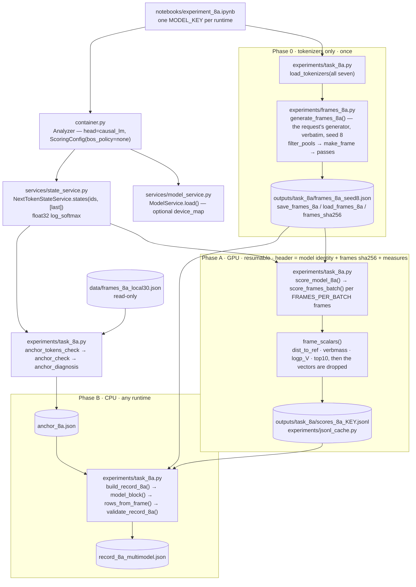

# Task 8a: recursion at scale, across models

## The question

Act 8 of the teaching document claims that after an embedded clause closes, the model's
next-token state *returns*: `The soldier that the singer trusted |` sits closer to the bare
subject `The soldier |` than a control of the same token length that ends on the same word
but has no clause to close (`The singer heard the soldier trusted |`). Locally the effect was
found at scale on GPT-2 124M (1.43× [1.34, 1.53] over 30 frames) and Qwen2.5-0.5B
(1.12× [1.05, 1.19]). Two models, two families, two numbers: whether the gap is family, size
or training cannot be said. Task 8a scores the same test on **seven models with one 200-frame
item set identical across all of them**, so that whatever differs between models is the model.

| key | model | role |
|---|---|---|
| `qwen25_0.5b` | Qwen2.5-0.5B | **anchor**: must reproduce the local record before anything else is read |
| `qwen3_0.6b` | Qwen3-0.6B-Base | reference model of the 9-series and 1b |
| `qwen3_1.7b` | Qwen3-1.7B-Base | size ladder |
| `qwen3_8b` | Qwen3-8B-Base | size ladder |
| `llama31_8b` | Llama-3.1-8B (base) | same size, other family |
| `gptoss_20b` | gpt-oss-20B | post-trained reasoning MoE, no base release; reported with that caveat, outside the pass rule |
| `gemma4_31b` | Gemma-4-31B (base) | largest |

**The measure.** At each prefix the state is `log_softmax(logits[-1])` over the model's
vocabulary in float32; the distance between two states is the L2 norm of their difference.
Per (embedded E, control C) pair, `ret = ‖s_E − s_REF‖` and `ctrl = ‖s_C − s_REF‖`. The
record also holds the **verb mass** at every stop (`Σ exp(s[id(" w")])` over the 70-word verb
pool, restricted per model to the words whose leading-space form is one token), `log P(V)`
for the frame's main verb at every stop, and the ten most probable next tokens after every
pass.

**Pass criterion (pre-registered, applied outside the repo).** On every base model, every
depth-1 structure's ratio interval with the token-matched control excludes 1.0. Depth 2 is
reported as pass / marginal / fail by the same rule; depth 3 reported, not interpreted; the
legacy `ORC_A` control reported alongside; the Qwen3 ladder stated as it falls. **Before any
of that**, the anchor: Qwen2.5-0.5B must reproduce the local run's 30 frames with
`|ret − ours| / ours < 0.02` on every row, likewise `ctrl`, and `|verbmass − ours| < 0.01`,
or the pipeline is not the report's and the notebook stops.

There is **no analysis and no figure in this repository**: the record carries raw rows, and
the ratios, frame-clustered bootstrap intervals, sign and Wilcoxon tests are computed from it.

## Data and how it is collected

Nothing is downloaded but the models. The items are **generated** by
`experiments/frames_8a.py`, whose generator is the request's code block copied unmodified
(the record's `meta.generator` says so): seed 8, 200 frames or 3,000 draws, each frame
twelve slots (`N1..N4, V2..V4, V, OBJ, CV1..CV3`) filling fourteen templates: the bare
subject `REF`, one embedded pass per clause type (`ORC`, `WHO`, `RED`, `SRC`, `EMB2`,
`EMB3`), a token-matched control per embedded pass (`*_B`) and the legacy control `ORC_A`.

Three filters, in order, applied with **all seven tokenizers** loaded first (phase 0):

1. **Word level**: every pool word is a single token with a leading space in every tokenizer
   (`len(tok(" " + w, add_special_tokens=False).input_ids) == 1`); words failing anywhere
   leave the pool before any frame is drawn. The surviving pool sizes are in `meta.pools`.
2. **Frame level**: per (embedded, control) pair and per tokenizer, `n_tok(E) == n_tok(C)`
   under the tokenizer's *default* `add_special_tokens` (a BOS is counted on both sides and
   cancels) and `last_token(E) == last_token(C)`; `ORC_A` is exempt from the last-token
   assertion by design but held to the count.
3. **Uniqueness**: no two frames share the same `(N1, V)`.

The frames file `frames_8a_seed8.json` pins the draw and is reused by every runtime; its sha256
is in every cache header and checked on merge. The anchor input `data/frames_8a_local30.json`
(the local run's 30 frames and Qwen2.5-0.5B's 210 rows) is committed and never written.

## Pipeline



## Files used

| File | Role in this task | Key functions |
|---|---|---|
| `notebooks/experiment_8a.ipynb` | Driver: frames (phase 0), anchor, one frame, phase A for this runtime's model(s), phase B merge | cells 8, 12, 14, 16, 18, 20, 22 |
| `data/frames_8a_local30.json` | The anchor input: the local run's 30 frames and Qwen2.5-0.5B's rows (`ret`, `ctrl`, `verbmass_*`, `n_tok`, `stop_tok`) | read by `load_anchor_file` only |
| `src/m1_analyzer/experiments/frames_8a.py` | The generator (verbatim) and its glue: codes, the verb pool, the sentence format, the token table, the frames file | `generate`, `filter_pools`, `passes`, `generate_frames_8a`, `token_table`, `token_assertions`, `verb_pool_kept`, `save_frames_8a`, `load_frames_8a`, `frames_sha256` |
| `src/m1_analyzer/experiments/task_8a.py` | The task: model registry, phase A scorer and cache, anchor, record, validation | `MODELS_8A`, `load_tokenizers`, `score_model_8a`, `score_frames_batch`, `frame_scalars`, `anchor_check`, `anchor_diagnosis`, `build_record_8a`, `validate_record_8a` |
| `src/m1_analyzer/container.py` | Loads the model once; `analyzer.states` and `analyzer.models` | `Analyzer` |
| `src/m1_analyzer/services/model_service.py` | Loading, dtype, provenance; `device_map` for the 20B / 31B checkpoints | `ModelService.load`, `.metadata` |
| `src/m1_analyzer/services/state_service.py` | The float32 log-softmax state at the last id of each prefix | `NextTokenStateService.states` |
| `src/m1_analyzer/experiments/jsonl_cache.py` | Resumable JSONL mechanics | `write_header`, `check_header`, `append_row`, `mirror` |
| `src/m1_analyzer/testing.py` | The tiny model with the frame words in its vocabulary, for the smoke test and the tests | `build_tiny_local_model(extra_vocab=FRAME_WORDS_8A)` |

## Outputs

All under `outputs/task_8a/`; the caches are keyed by model, the rest is shared.

| File | Format | Holds |
|---|---|---|
| `frames_8a_seed8.json` | JSON | `meta{seed, n_frames_requested, n_frames, pools, tokenizers_filtered_on, generator}`, `verb_pool`, `frames[{N1..CV3, sentences{code: "prefix \|suffix"}}]` |
| `scores_8a_<key>.jsonl` | JSONL: header = model identity + frames sha256 + every measure's definition, then one line per frame | `frame`, `n_tok{code}`, `last_tok{code}`, `v_id`, `dist_to_ref{code}`, `verbmass{code}`, `logp_V{code}`, `top10{code}`, `seconds` |
| `anchor_8a.json` | JSON | the summary the record keeps plus `per_row` (ours vs theirs for all 210 rows), `worst`, `token_mismatches`, the model's identity |
| `record_8a_multimodel.json` | JSON, the deliverable | `meta`, `verb_pool`, `frames`, `models{key: {meta{hf_id, revision, weight_dtype, logits_dtype, bos_added, n_params_b, vocab_size}, verb_pool_kept, tokens[{frame, code, n_tok, last_tok}], rows[{frame, structure, control, ret, ctrl, verbmass_ref/emb/ctrl, logp_V_ref/emb/ctrl}], top10{"frame:code": [[str, prob], ...]}}}`, `anchor{model, frames_file, max_rel_diff_ret, max_rel_diff_ctrl, max_abs_diff_verbmass, n_rows, pass}` |

One `rows` entry per (frame, pair): seven pairs per frame, 1,400 rows per model for 200
frames; fourteen `tokens` entries and fourteen `top10` lists per frame. Distances are in the
model's own log-probability space, nothing normalised.

## Worked example

!!! note "Illustrative, not a result"
    Produced by `scripts/make_doc_examples.py` on a random 4-layer GPT-2 whose word-level
    vocabulary carries every frame word, from three frames generated with its own tokenizer.
    The distances and probabilities are meaningless; the shapes, the header and the record
    are the real ones.

=== "Frames file"

    Three frames drawn with seed 8 on the tiny tokenizer (the real run filters on seven):

    ```json
    --8<-- "docs/assets/examples/frames_8a_tiny.json"
    ```

=== "Cache row"

    The header pins the model, the frames file's sha256 and the measures; one line per frame
    follows (top-10 lists trimmed):

    ```json
    --8<-- "docs/assets/examples/scores_8a_tiny_header.json"
    ```

    ```json
    --8<-- "docs/assets/examples/scores_8a_tiny_row.json"
    ```

=== "Record"

    `build_record_8a`, one model, rows and token entries trimmed:

    ```json
    --8<-- "docs/assets/examples/record_8a_tiny.json"
    ```

## Configuration knobs

| Notebook field | Default | Reaches |
|---|---|---|
| `MODEL_KEY` | `qwen25_0.5b` | which model(s) this runtime scores (`all-small` = the three ≤ 2B models) |
| `HF_ID_OVERRIDES`, `REVISION_OVERRIDES`, `TRUST_REMOTE_CODE` | `{}`, `{}`, off | `ModelSpec.with_overrides`: the id / commit actually loaded (the record stores them) |
| `DTYPE` | `auto` | `ModelConfig.dtype`: bf16 on Ampere+, fp16 on a T4, fp32 on CPU; the logits are float32 regardless |
| `DEVICE_MAP` | `""` | `ModelConfig.device_map`: `auto` streams a 20–60 GB checkpoint straight to the GPU |
| `FRAMES_PER_BATCH` | 8 | frames per forward batch (× 14 prefixes); lower on OOM |
| `N_FRAMES`, `SEED`, `MAX_DRAWS` | 200, 8, 3000 | the pre-registered draw (`generate_frames_8a`) |
| `ANCHOR_FILE`, `TOL_REL`, `TOL_VERBMASS` | `data/frames_8a_local30.json`, 0.02, 0.01 | `anchor_check` |
| `LIMIT`, `RESUME`, `MIRROR_EVERY`, `MIRROR_TO_DRIVE`, `DRIVE_DIR` | | dry run, cache reuse, the Drive mirror |

## What the numbers mean

- A prefix is everything before `|` in a sentence, with no trailing space; its ids are
  `tok(prefix)` with the tokenizer's **default** special tokens (`bos_added` in the record says
  whether that adds a BOS), and the state is read at the last id. The state service is used
  with `bos_policy="none"` so nothing is added twice.
- `ret`, `ctrl`: L2 distances from the embedded / control state to `REF`'s, in the model's
  own log-probability space. Vocabulary size differs across models; ratios are within-model.
- `verbmass_*`: `Σ exp(s[id])` over `verb_pool_kept`, the pool words that are one token with
  a leading space in *that* tokenizer; computed per model, never copied.
- `logp_V_*`: the log-probability of `" V"` (the frame's main verb, one token by the pool
  filter) at the stop.
- `top10`: `[decoded string, probability]` for the ten most probable next tokens after every
  pass, so the hero figure can be drawn for every model without re-running anything.
- `tokens`: `n_tok` and `last_tok` of every pass, so the two assertions can be re-checked from
  the record alone (`validate_record_8a` does).

## Resumability and guards

- The cache header pins the model key, `hf_id`, resolved revision, weight dtype, `bos_added`,
  vocabulary size and the frames file's sha256; a resume under any other value refuses and
  names the field.
- `score_frames_batch` re-checks both token assertions for every frame under the loaded
  tokenizer before its forward pass, so a tokenizer that drifted since phase 0 fails loudly.
- On the anchor runtime, phase A refuses to score the 200 frames unless `anchor_8a.json`
  records a pass; a failed anchor stops the notebook with a diagnosis (token mismatches,
  the worst row, and whether a trailing space or a prepended BOS / EOS reproduces the local
  value).
- One fsynced JSONL line per frame; the Drive mirror every `MIRROR_EVERY` frames; phase B
  restores whichever caches Drive holds and lists the models still missing.

## Where to look next

- Notebook: [`notebooks/experiment_8a.ipynb`](https://github.com/SalmonSung/m1_llms_analyzer/blob/main/notebooks/experiment_8a.ipynb)
- Architecture flow: [How an experiment flows (Task 8a)](../architecture.md#how-an-experiment-flows-task-8a)
- Design decisions: [Experiments (Task 8a)](../design_decisions.md#experiments-task-8a)
- Tests: `tests/test_task_8a.py`
