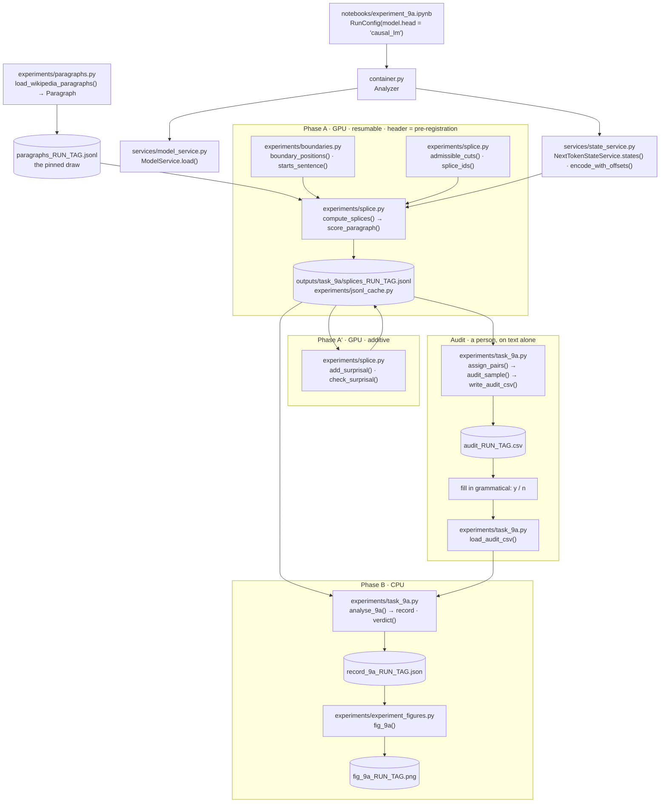
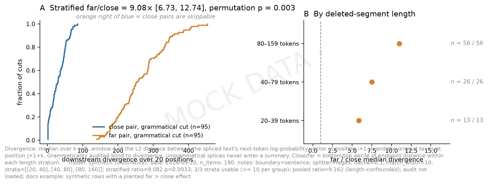
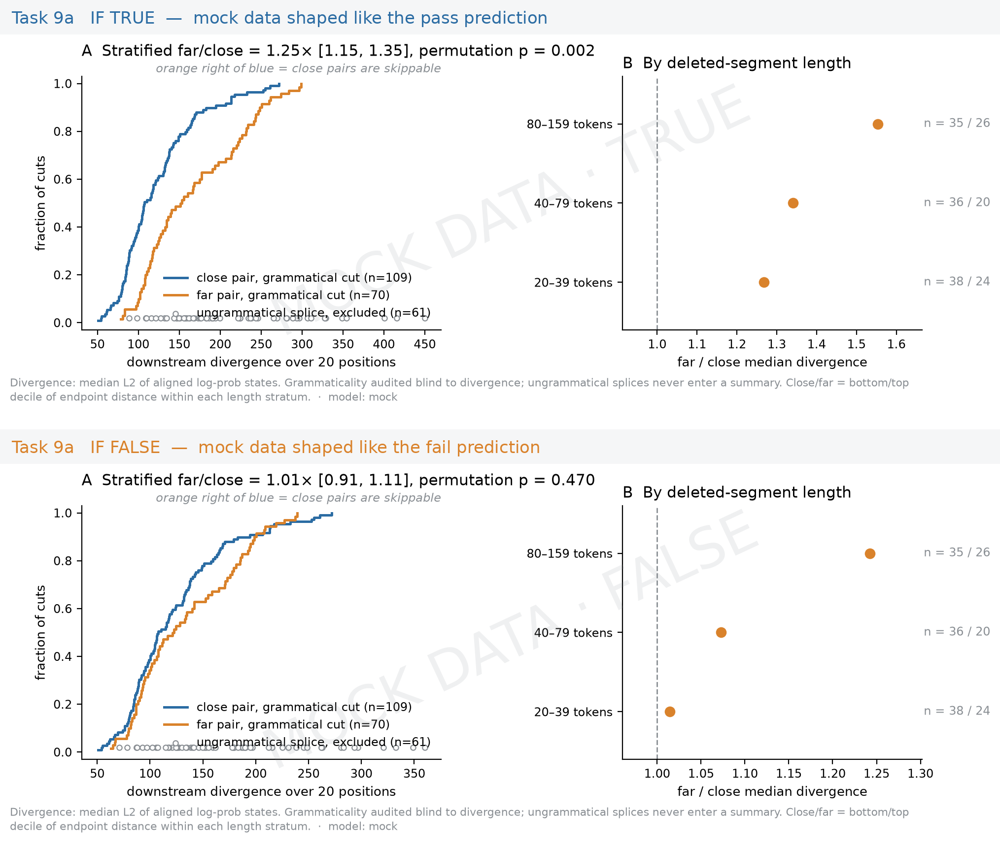

# Task 9a: omittability by splicing

## The question

Take a paragraph, pick two sentence boundaries `i < j`, delete everything strictly after
`i` up to and including `j`, and rejoin the text. The model's next-token distribution at
a position is its *state* there. If the states at the two endpoints of the original text
are *close*, does the deletion disturb what follows less than when they are *far*? That
is the "skip reading" of omittability: a stretch of text between two near-identical
states is skippable.

Two things make this harder than a pooled comparison. Divergence after the splice grows
with how much was deleted, and so does the endpoint distance, so close and far cuts are
compared **within strata of deleted length**, with the labels assigned inside
length-matching bins. And a splice must be grammatical to be a fair test, so admissibility
is built into how cuts are generated and a **blind hand audit** confirms it on a sample.
**Pass**: one stratified permutation test, `p < 0.05` with far/close median ratio above 1.

## Data and how it is collected

- **Source**: English Wikipedia, dataset `wikimedia/wikipedia`, config `20231101.en`,
  split `train`, **streamed** through `datasets.load_dataset(..., streaming=True)` by
  `paragraphs.iter_wikipedia_paragraphs`. Nothing is downloaded in bulk. Wikipedia was
  chosen over wikitext because wikitext is Moses-tokenised
  ([design decision](../design_decisions.md#experiments-task-9a)).
- **Selection**: `paragraphs.load_wikipedia_paragraphs(count_tokens, n=200, min_tokens=150,
  max_tokens=300, min_sentences=5, seed=42)`. Articles stream in, each line becomes a
  candidate, `clean_paragraph` collapses whitespace and requires a sentence-like ending,
  `select_paragraphs` keeps those within the token range (counted with the *model's*
  tokenizer) and with enough sentences, fills a pool of `pool_factor × n` candidates in
  source order and draws a seeded sample from it.
- **Pinning the draw**: the notebook writes the selection to `paragraphs_<RUN_TAG>.jsonl`
  and its *Pin the corpus* cell restores that file by id on a later run, because a single
  shifted candidate in the stream would otherwise re-draw the whole sample. The
  fingerprint (sha256 over sorted ids) goes into the cache header as `corpus_sha256`.
- **Alternative source**: `paragraphs.load_paragraph_file` reads a blank-line-separated
  `.txt` or a JSONL with a `text` key.
- **Sentence boundaries**: NLTK's `punkt` splitter (`nltk.download("punkt_tab")`) or an
  offline regex, mapped through the tokenizer's character offsets in
  `boundaries.sentence_final_positions`. A boundary is validated on **both** sides: the
  token ends a sentence and `starts_sentence` confirms that the text after it begins one,
  so an abbreviation punkt split on cannot serve as an endpoint. Every rejected sentence
  end is counted.

## Pipeline



Per paragraph, phase A runs **one pass of the original** text (endpoint states, downstream
states, and the surprisal of every token) and **one pass per cut** of the spliced ids.
The pre-registration (measure, window, strata, decile, matching width, boundary rule,
schema) is written as the cache header *before* the first cut is scored.

## Files used

| File | Role in this task | Key functions |
|---|---|---|
| `notebooks/experiment_9a.ipynb` | Driver, including the *Pin the corpus* cell and the audit round trip | cells 8, 15, 16, 20, 22, 24, 26 |
| `src/m1_analyzer/container.py` | Loads the model with its LM head; exposes `analyzer.states` | `Analyzer` |
| `src/m1_analyzer/services/state_service.py` | Token ids → full next-token log-softmax vectors at chosen positions, float32 | `NextTokenStateService.states`, `encode_with_offsets`, `decode` |
| `src/m1_analyzer/experiments/paragraphs.py` | The corpus: streaming, cleaning, filtering, seeded sampling, files | `load_wikipedia_paragraphs`, `select_paragraphs`, `load_paragraph_file`, `Paragraph` |
| `src/m1_analyzer/experiments/boundaries.py` | Sentence-final and clause-final token positions, validated on both sides | `boundary_positions`, `sentence_final_positions`, `starts_sentence` |
| `src/m1_analyzer/experiments/splice.py` | Phase A: cuts, splicing on ids, distances, divergence, fluency, surprisal, the cache | `admissible_cuts`, `splice_ids`, `score_paragraph`, `compute_splices`, `add_surprisal`, `check_surprisal`, `load_splices`, `preregistration` |
| `src/m1_analyzer/experiments/jsonl_cache.py` | Resumable JSONL mechanics | `write_header`, `check_header`, `append_row`, `rewrite`, `mirror` |
| `src/m1_analyzer/experiments/task_9a.py` | Labels, audit sheet, the stratified test, cluster bootstrap, boundary re-check, record, verdict | `assign_pairs`, `audit_sample`, `write_audit_csv`, `load_audit_csv`, `analyse_9a`, `boundary_check`, `verdict` |
| `src/m1_analyzer/experiments/experiment_figures.py` | The figure | `fig_9a` |

## Outputs

All under `outputs/task_9a/`, with `RUN_TAG = slug(MODEL_ID)_slug(CORPUS)_w<WINDOW>`.

| File | Format | One line / record holds |
|---|---|---|
| `paragraphs_<RUN_TAG>.jsonl` | JSONL, one `Paragraph` per line | `id`, `text`, `source`, `info` (article title, ...). The only durable record of a draw |
| `splices_<RUN_TAG>.jsonl` | JSONL: header = pre-registration, then one line per paragraph | Row: `text`, `n_tokens`, `boundaries`, `n_rejected_boundaries`, `fluency`, `surprisal[]`, `cuts[]`; each cut: `i, j, boundary, seg_len, char_i, char_j, d, div, div_k[], fl, retokenises, join, del_surp, del_surp_mean` |
| `audit_<RUN_TAG>.csv` | CSV, columns `key, paragraph, i, j, pair, boundary, seg_len, join, spliced_text, grammatical, note` | Text only, never a divergence. A person fills `grammatical` |
| `record_9a_<RUN_TAG>.json` | JSON, the `fig_9a` schema plus extras | `cuts[]` (labelled close / far only), `strata[]`, `stratified{ratio, ci, p}`, `pooled`, `audit`, `meta`, `diagnostics{continuous, boundary_check, surprisal}` |
| `fig_9a_<RUN_TAG>.png` | PNG | A: divergence ECDFs for close vs far; B: far/close ratio per stratum |

## Worked example

!!! note "Illustrative, not a result"
    Produced by `scripts/make_doc_examples.py`. The cut enumeration runs on a hand
    paragraph with whitespace tokens; the cache row, audit sheet and tiny record come
    from a random 4-layer GPT-2 with a 39-token vocabulary (`m1_analyzer.testing`), so
    the numbers are meaningless and the keys real; the synthetic record and its figure
    come from generated rows with a planted far > close effect (the test suite's
    generator). No real results are stored in this repository.

=== "Cuts by hand"

    From a paragraph to its admissible cuts and one spliced text, with no model involved:

    ```text
    --8<-- "docs/assets/examples/cuts_by_hand.txt"
    ```

=== "Cache row"

    The header of a `splices_*.jsonl` written on the tiny model (window 5, regex splitter,
    small strata) and its first paragraph line, `surprisal` already added:

    ```json
    --8<-- "docs/assets/examples/splices_tiny_header.json"
    ```

    ```json
    --8<-- "docs/assets/examples/splices_tiny_row.json"
    ```

    The report `add_surprisal` / `check_surprisal` return, with the two invariants
    (lengths, and `mean(surprisal) == fluency` over all tokens):

    ```json
    --8<-- "docs/assets/examples/surprisal_report.json"
    ```

=== "Audit sheet"

    `write_audit_csv` on the tiny-model cache: 2 close, 2 far, 2 other cuts. The person
    sees the spliced text and the join and fills `grammatical`:

    ```csv
    --8<-- "docs/assets/examples/audit_tiny.csv"
    ```

=== "Record"

    `analyse_9a` on synthetic rows (100 paragraphs × 15 cuts, effect planted), three cuts
    shown, then `verdict`:

    ```json
    --8<-- "docs/assets/examples/record_9a_synthetic.json"
    ```

    ```text
    --8<-- "docs/assets/examples/verdict_9a.txt"
    ```

    The same analysis on the tiny model's real cache (few cuts, `min_per_group=1`):

    ```json
    --8<-- "docs/assets/examples/record_9a_tiny.json"
    ```

=== "Figures"

    `fig_9a` from the synthetic record:

    

    What the runbook expects a pass and a fail to look like (`experiment_figures.mock_9a`):

    

## Configuration knobs

| Notebook field | Default | Reaches |
|---|---|---|
| `MODEL_ID`, `DTYPE` | `Qwen/Qwen3-0.6B-Base`, `auto` | `ModelConfig(head="causal_lm")` |
| `CORPUS` | `wikipedia` | `load_wikipedia_paragraphs` or, for a path, `load_paragraph_file` |
| `N_PARAGRAPHS`, `MIN_TOKENS`, `MAX_TOKENS`, `MIN_SENTENCES`, `MAX_ARTICLES`, `SEED` | 200, 150, 300, 5, 20000, 42 | `select_paragraphs` filters and seeded sample |
| `WINDOW` | 20 | `compute_splices(window)`: tokens compared after the join, and required after `j` |
| `STRATA` | `20-40,40-80,80-160` | deleted-length strata `[lo, hi)`; in the header |
| `DECILE` | 0.1 | fraction of each matching bin labelled close and far |
| `MATCH_WIDTH` | 10 | width in tokens of the length-matching bins inside each stratum |
| `SPLITTER` | `punkt` | `boundaries.sentence_char_spans(splitter)`; `regex` is the offline fallback |
| `BOUNDARY_KINDS` | `sentence,clause` | both stored; only `sentence` is compared (the primary boundary) |
| `AUDIT_CLOSE`, `AUDIT_FAR`, `AUDIT_OTHER` | 10, 10, 10 | `audit_sample(n_close, n_far, n_other)` |
| `N_PERM`, `N_BOOT`, `MIN_PER_GROUP` | 5000, 1000, 10 | `analyse_9a`: permutation test, cluster bootstrap, usable-stratum rule |
| `BATCH_SIZE` | 4 | spliced sequences per forward pass |
| `RESUME`, `MIRROR_TO_DRIVE`, `DRIVE_DIR` | `True`, `False`, Drive path | cache reuse and mirror |

## What the numbers mean

- **State**: float32 log-softmax over the vocabulary at a position.
- **`d`**, endpoint distance: L2 between the original text's states at `i` and `j`.
- **`div_k`** for `k < window`: L2 between the spliced state at `i+1+k` and the original at
  `j+1+k` (the same token, with and without the deleted sentences before it).
  **`div`** is their median, the pre-registered divergence.
- **`fl`**: the spliced text's fluency in nats per token (exploratory; never the verdict).
- **`surprisal[t] = -log p(ids[t] | ids[:t])`** from the same original pass;
  `fluency = mean(surprisal)` over all tokens, token 0 included.
  **`del_surp`** is its sum over the deleted tokens, **`del_surp_mean`** that sum over
  `seg_len`: a second matching variable beside length.
- **Close / far**: bottom / top `DECILE` of `d` within `MATCH_WIDTH`-token bins of deleted
  length inside each stratum, pooled across paragraphs.
- **The verdict**: the stratum-size-weighted mean of `log(median far / median close)`,
  with a permutation test that shuffles labels within bins, and a paragraph-level
  cluster-bootstrap interval. The pooled ratio, per-stratum Mann-Whitney values and the
  partial Spearman of `d` vs `div` given log length (and `del_surp`) are diagnostics.
- Raw distances scale with the vocabulary size: compare within one model only.

## Resumability and guards

- The header is the pre-registration. `schema` is a **checked** field: a schema-1 cache
  was built under the one-sided boundary rule and cannot be resumed under the two-sided
  one.
- `add_surprisal` fills `surprisal` / `del_surp` into an existing cache with new keys
  appended last and every old byte kept (atomic rewrite), so an audit sheet keyed on that
  cache still lines up; it is a no-op when complete.
- `boundary_check` in phase B re-verifies every stored endpoint against the current rule
  and splits any failures by close / far.
- A failed audit is reported as a violation and excluded from the comparison; unaudited
  cuts carry `audited: false`.

## Where to look next

- Notebook: [`notebooks/experiment_9a.ipynb`](https://github.com/SalmonSung/m1_llms_analyzer/blob/main/notebooks/experiment_9a.ipynb)
- Architecture flow: [How an experiment flows (Task 9a)](../architecture.md#how-an-experiment-flows-task-9a)
- Design decisions: [Experiments (Task 9a)](../design_decisions.md#experiments-task-9a)
- Tests: `tests/test_boundaries.py`, `tests/test_paragraphs.py`, `tests/test_splice.py`, `tests/test_task_9a.py`, `tests/test_state_service.py`
