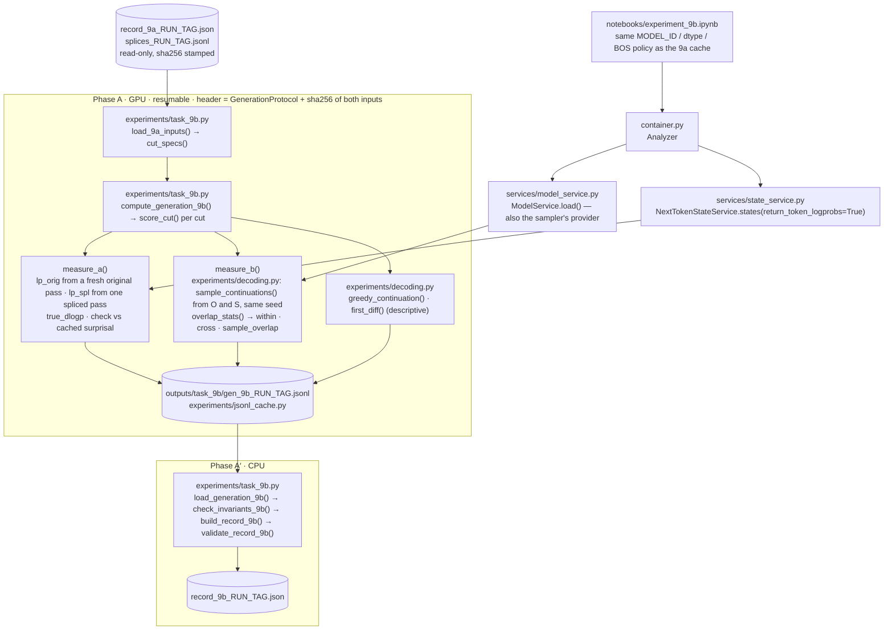
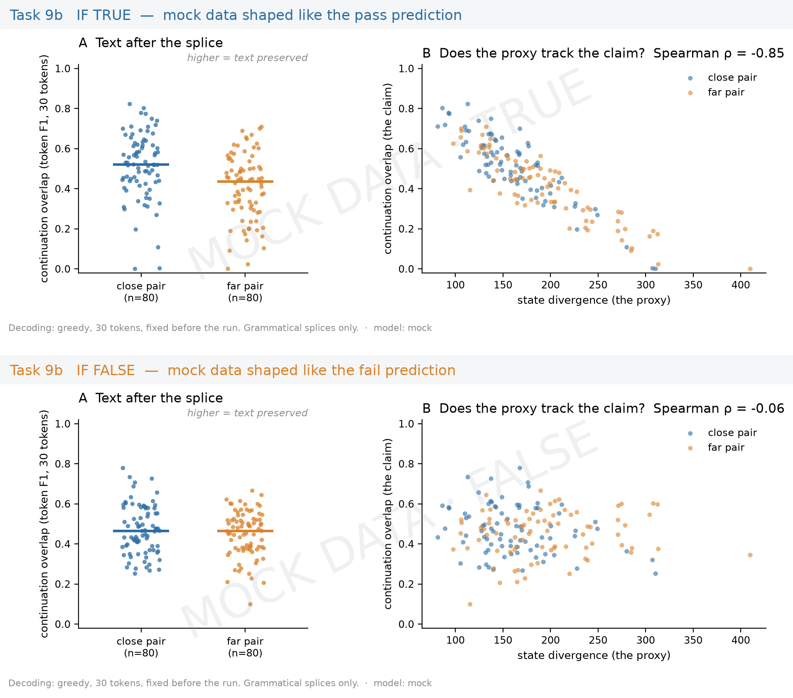

# Task 9b: does the deletion change what the model *writes*?

## The question

Task 9a compares next-token *distributions* after a splice. The claim it stands in for is
about the *text* that follows. One greedy continuation cannot measure that: after a
sentence boundary the next sentence is nearly free, and greedy decodes from the original
and the spliced context part within a few tokens either way. So Task 9b takes every
labelled close / far cut of the 9a record and measures two things that do not depend on
a single decode, every parameter fixed before anything is generated:

- **Measure A, the author's actual continuation.** The log-probability of the next
  `W = 20` real tokens under the original and under the spliced context;
  `true_dlogp` is the mean difference in nats per token (positive: the deletion made the
  real text less likely).
- **Measure B, sampled continuations compared as distributions.** `K = 16` nucleus
  samples of `L = 30` tokens from the original context O and from the spliced context S,
  paired by seed, compared as bags of token ids: `within` (mean token F1 over O–O pairs),
  `cross` (over O–S pairs) and `sample_overlap = cross / within`.

There is **no verdict and no figure in this repository**: the pre-registered analysis
(far vs close on both measures within 9a's length strata, Spearman with `state_div`) is
run from the record, outside the repo.

## Data and how it is collected

Nothing new is collected. The inputs are Task 9a's two files, opened **read-only** and
sha256-stamped into the 9b cache header by `task_9b.load_9a_inputs`:

- `record_9a_<RUN_TAG>.json`: its `cuts` are exactly the labelled close / far cuts, in
  order; that order is the `cut_index` and seeds each cut's sampler.
- `splices_<RUN_TAG>.jsonl`: the paragraph texts and their per-token `surprisal`, which
  is the invariant `lp_orig` is checked against.

The notebook restores both from the 9a Drive folder when they are missing locally and
refuses to run when the cache's `model_id` differs from `MODEL_ID`. `RUN_TAG` is
deliberately the same as 9a's, so the files are found by name.

## Pipeline



## Files used

| File | Role in this task | Key functions |
|---|---|---|
| `notebooks/experiment_9b.ipynb` | Driver: restores the 9a files, walks one cut, phase A, record and invariants | cells 8, 14, 16, 18, 20 |
| `src/m1_analyzer/container.py` | Loads the model once; `analyzer.states` and `analyzer.models` | `Analyzer` |
| `src/m1_analyzer/services/state_service.py` | Per-token log-probabilities of a sequence (measure A) | `NextTokenStateService.states(..., return_token_logprobs=True)`, `encode`, `decode` |
| `src/m1_analyzer/services/model_service.py` | The `ModelProvider` the sampler draws from | `ModelService.model`, `.tokenizer` |
| `src/m1_analyzer/experiments/decoding.py` | Task-agnostic generation: nucleus sampling from a per-call `torch.Generator`, greedy, token F1, overlap stats | `sample_continuations`, `greedy_continuation`, `token_f1`, `overlap_stats`, `first_diff`, `nucleus_filter` |
| `src/m1_analyzer/experiments/splice.py` | Reads the 9a cache; splices ids | `load_splices`, `splice_ids` |
| `src/m1_analyzer/experiments/task_9a.py` | Labels and cut keys shared with 9a | `CLOSE`, `FAR`, `cut_key` |
| `src/m1_analyzer/experiments/task_9b.py` | The task: protocol, inputs, the two measures, the cache, the record, the invariants | `GenerationProtocol`, `load_9a_inputs`, `cut_specs`, `measure_a`, `measure_b`, `score_cut`, `compute_generation_9b`, `check_invariants_9b`, `build_record_9b`, `validate_record_9b` |
| `src/m1_analyzer/experiments/jsonl_cache.py` | Resumable JSONL mechanics | `write_header`, `check_header`, `append_row`, `mirror` |

## Outputs

All under `outputs/task_9b/`, with 9a's `RUN_TAG`.

| File | Format | One line / record holds |
|---|---|---|
| `gen_9b_<RUN_TAG>.jsonl` | JSONL: header = protocol + `source_record` / `source_cache` sha256 + model, then one line per cut | `key, cut_index, paragraph, i, j, pair, stratum, seg_len, state_div, seed`, `lp_orig[]`, `lp_spl[]`, `true_dlogp_k[]`, `true_dlogp`, `cached_lp_orig_max_abs_diff`, `samples_orig[K][L]`, `samples_spliced[K][L]`, `within`, `cross`, `within_spliced`, `sample_overlap`, `greedy_orig`, `greedy_spliced`, `first_diff_greedy`, `n_eos_*`, `seconds` |
| `record_9b_<RUN_TAG>.json` | JSON | `cuts[]` (the requested fields, then the additive ones), `protocol`, `meta`, `invariants{max_abs_cached_lp_diff, keys_match, n_collapsed, ...}`, `source{record, cache, sha256}` |
| `splices_<RUN_TAG>.jsonl`, `record_9a_<RUN_TAG>.json` | copies | The read-only inputs, restored beside the outputs |

Every sampled continuation is stored, so another overlap function can be applied to the
cache later without generating again.

## Worked example

!!! note "Illustrative, not a result"
    Produced by `scripts/make_doc_examples.py` on a random 4-layer GPT-2 with a 40-word
    vocabulary, from a miniature 9a run on the hand paragraphs (window 5, protocol
    `W_true=5, K=4, L=6`). Token ids and their decoded text are meaningless; the keys,
    the header and the invariants are the real ones. `experiment_figures.mock_9b` draws
    the runbook's illustration of this task with a *different* schema from the record
    (it predates the record's design); it is shown for orientation only.

=== "Cache row"

    The header pins the protocol and both input hashes; one line per cut follows. Two of
    the four samples per context are also shown decoded:

    ```json
    --8<-- "docs/assets/examples/gen_9b_tiny_header.json"
    ```

    ```json
    --8<-- "docs/assets/examples/gen_9b_tiny_row.json"
    ```

=== "Record"

    `build_record_9b`, two cuts shown, with the three invariants:

    ```json
    --8<-- "docs/assets/examples/record_9b_tiny.json"
    ```

=== "Mock figure"

    

## Configuration knobs

| Notebook field | Default | Reaches |
|---|---|---|
| `MODEL_ID`, `DTYPE`, `CORPUS`, `WINDOW` | as in 9a | `RUN_TAG` and the model; must match the 9a cache |
| `W_TRUE` | 20 | `GenerationProtocol.W_true`: tokens of the author's continuation scored |
| `K_SAMPLES`, `L_NEW_TOKENS` | 16, 30 | `GenerationProtocol.K`, `.L`: samples per context and their fixed length |
| `TOP_P`, `TEMPERATURE` | 0.95, 1.0 | nucleus sampling |
| `SEED_BASE` | 20250914 | per-cut `torch.Generator` seed `= SEED_BASE + cut_index`, the same for O and S |
| `USE_KV_CACHE` | `True` | `compute_generation_9b(kv_cache=...)`; a re-feed-everything oracle exists for tests |
| `LIMIT` | 0 | dry run on the first `LIMIT` cuts |
| `TOL_LP` | `1e-5` | tolerance of invariant 1 |
| `MIRROR_EVERY`, `RESUME`, `MIRROR_TO_DRIVE`, `DRIVE_DIR_9A`, `DRIVE_DIR` | | cache reuse, the 9a restore and the mirror |

## What the numbers mean

- `lp_orig[k] = log p(ids[j+1+k] | ids[:j+1+k])` from a fresh pass of the original ids in
  the same session; `lp_spl[k] = log p(spliced[i+1+k] | spliced[:i+1+k])` from one pass of
  the spliced ids; the target token is the same in both. `true_dlogp = mean_k(lp_orig - lp_spl)`.
- The 9a cache's `surprisal` is `-lp_orig` to 6 decimals: **invariant 1** is
  `max |lp_orig + surprisal| <= tol` over every cut.
- **Invariant 2**: the cache's cut keys equal the 9a record's, in order.
- **Invariant 3**: `within > 0` for every cut; a collapsed sample set leaves measure B
  undefined there and is reported, never adjusted.
- `within`, `cross` are means of multiset token F1 over ids; `sample_overlap = cross / within`.
- EOS is an ordinary token: never suppressed, never a stop; every sample has exactly `L` ids.
- `first_diff_greedy`: the first position at which greedy decodes from O and S differ,
  capped. Descriptive only.

## Resumability and guards

- The header pins the whole `GenerationProtocol` and the sha256 of both 9a inputs; a
  resume with a different protocol or a changed 9a file refuses and names the field.
- A paragraph whose text re-encodes to a different token count than the cache recorded
  raises: the cuts would not line up.
- One fsynced JSONL line per cut; the Drive mirror every `MIRROR_EVERY` cuts.
- The 9a files are inputs only; nothing writes to them (the tests check they are
  byte-unchanged).

## Where to look next

- Notebook: [`notebooks/experiment_9b.ipynb`](https://github.com/SalmonSung/m1_llms_analyzer/blob/main/notebooks/experiment_9b.ipynb)
- Architecture flow: [How an experiment flows (Task 9b)](../architecture.md#how-an-experiment-flows-task-9b)
- Design decisions: [Experiments (Task 9b)](../design_decisions.md#experiments-task-9b)
- Tests: `tests/test_decoding.py`, `tests/test_task_9b.py`
