# Tree recovery on the runner: jobs C, B and A

## The question

The tree-recovery runbook asks whether a model's constituency tree can be recovered by summing
several constituency tests, each against its own same-length baseline. Three of its
pre-registered tasks need a GPU and run on models this repository has already used:

| job | what | model | size | deliverable |
|---|---|---|---|---|
| **C** | **T1**: a second span signal, the distance between the model's next-word predictions at a span's two ends: L2 and Jensen–Shannon | Qwen3-0.6B-Base, float32 | 1,000 forward passes; 173,966 spans | `tree_t1_qwen3_0.6b.jsonl` |
| **B** | **8a with a second distance**: Jensen–Shannon (`js_ret`, `js_ctrl`) and the head share (`head_ret`, `head_ctrl`) on every row, `ret`/`ctrl` repeated as the check | the five models of the 8a run, float32 | the 8a passes again | `record_8a_js.json` |
| **A** | **T4**: 1b's fluency measure fixed so a removed span cannot pay for itself: every substituted sentence scored token by token, with its own end mark appended | Qwen3-0.6B-Base, float32 | 2,957,422 substituted sentences + 1,000 originals | `tree_t4_qwen3_0.6b.jsonl.gz` |

Suggested order: C, then B, then A (smallest first). There is no analysis here: the runbook's
readings are computed from the deliverables elsewhere.

**Why job B.** On the 200-frame 8a run the L2 distance was carried almost entirely by the
improbable words (99.4 % on GPT-2, 99.6 % on Qwen2.5-0.5B of the squared distance comes from
words outside both predictions' top 100), and two cells did not clear 1.0. Jensen–Shannon
reads the likely words; the head share says, per row and per model, how much of the L2 the top
100 carry.

## The reference code

`experiments/tree_runner_ref.py` is the package's reference implementation, copied
**byte-for-byte** (sha256 `8d7c67289c70…`, pinned by `tests/test_tree_runner.py`; every meta
block records the sha and `reference_code_modified`). Jobs A and C call its `t1_rows` and
`t4_rows` with our loaded model and tokenizer; job B uses its `jsd_distance`. It reproduces
the Task 1b cache's conventions:

1. **Text**: NLTK's `TreebankWordDetokenizer` on the words after unescaping `\/` and `\*`.
   The repo's own `treebank.detokenize_ptb` unescapes after detokenising, converts
   parentheses and collapses whitespace; on the 1b cache's words (punctuation and traces are
   already removed, so no `-LRB-` / `-RRB-`) both give the same string.
2. **Sentence-initial substitution**: the first letter is upper-cased. The repo's
   `proforms.substitute` capitalises the filler (or, for `<del>`, the new first word) before
   detokenising, which is the same string whenever the sentence does not start with
   punctuation, which it never does after punctuation removal.
3. **BOS**: `<|endoftext|>` prepended as an id; no end token is scored in the 1b totals. (The
   repo's scorer under `bos_policy="auto"` prepends the tokenizer's BOS, or its EOS when it has
   none; for Qwen3-Base the package reports this is `<|endoftext|>`, and job A's check 2
   confirms it on the first 50 sentences.)

## Pipeline

```mermaid
flowchart TD
    NB["notebooks/experiment_tree.ipynb<br/>one JOB per runtime"] --> CFG["JOB = C / B / A"]
    subgraph AC["Jobs A and C · Qwen3-0.6B-Base @ da87bfb6 · float32"]
        C1B[("1b span-cost cache<br/>words · tree · spans[it] keys · 17 fillers")] --> L1["experiments/tree_runner.py<br/>load_1b_cache()"]
        L1 --> RUN["run_t1() / run_t4()<br/>resumable working cache, one line per sentence"]
        LM["tree_runner.load_model_f32()<br/>Analyzer · float32 · BOS &lt;|endoftext|&gt;"] --> RUN
        RUN --> REF["experiments/tree_runner_ref.py (unmodified)<br/>t1_rows() · t4_rows(end_string(tree))"]
        ANC[("data/anchor_tree_local.json")] --> CHK["check_t1_anchor · check_t4_anchor<br/>check_t4_cache · check_t4_causality"]
        RUN --> CHK
        CHK --> FIN["run_meta() → finalize()"]
        FIN --> OUTC[("tree_t1_qwen3_0.6b.jsonl<br/>tree_t4_qwen3_0.6b.jsonl.gz")]
    end
    subgraph B["Job B · one model per runtime · the 8a pipeline unchanged"]
        FR[("frames_8a_seed8.json")] --> SB["experiments/task_8a_js.py<br/>score_model_8a_js() → score_frames_js_batch()"]
        SB --> PM["pair_measures(): ret · ctrl · js · head_share"]
        PM --> JC[("scores_8a_js_KEY.jsonl")]
        R8[("record_8a_multimodel.json")] --> LM2["l2_match(): ≤ 2 % on every row"]
        JC --> LM2
        LM2 --> BR["build_record_8a_js()"]
        BR --> OUTB[("record_8a_js.json")]
    end
```



## Files used

| File | Role | Key functions |
|---|---|---|
| `notebooks/experiment_tree.ipynb` | Driver: config, smoke test, inputs and model, the check, the full run, the deliverable, job B | one `JOB` per runtime |
| `src/m1_analyzer/experiments/tree_runner_ref.py` | The reference code, verbatim | `t1_rows`, `t4_rows`, `jsd_distance`, `end_string`, `text_of`, `sub_text` |
| `src/m1_analyzer/experiments/tree_runner.py` | Jobs A and C around the reference: inputs, model, resumable loops, checks, meta, deliverable | `load_1b_cache`, `load_model_f32`, `run_t1`, `run_t4`, `check_*`, `run_meta`, `finalize` |
| `src/m1_analyzer/experiments/task_8a_js.py` | Job B | `head_share`, `pair_measures`, `score_model_8a_js`, `l2_match`, `build_record_8a_js`, `validate_record_8a_js` |
| `src/m1_analyzer/experiments/task_8a.py`, `frames_8a.py` | Job B reuses the 8a prefixes, ids, assertions and model registry unchanged | `prefix_ids`, `frame_prefixes`, `token_assertions`, `MODELS_8A` |
| `src/m1_analyzer/experiments/jsonl_cache.py` | Resumable JSONL mechanics for every working cache | `write_header`, `check_header`, `append_row`, `mirror` |
| `data/anchor_tree_local.json` | The package's anchor: T1 for the first 20 sentences (3,505 spans), `t4_rows` for `wsj_0001.mrg:1` and `wsj_0003.mrg:5` (2,686 substitutions) | `tree_runner.load_anchor` |

## The checks — run and read before the full job

The notebook's section 7 (A, C) and section 10 (B) run these on the first sentences and
**stop** if one fails; the full-run cell refuses to start without a passing `checks_*.json`.

| job | check | pass |
|---|---|---|
| C | the 20 anchor sentences vs the anchor, per distance | Spearman ≥ 0.999 and median relative difference ≤ 1 % (L2 and JS) |
| A-1 | the two anchor sentences vs the anchor | `n_tok`, `n_pre`, `n_suf` identical on every row; `total`, `suf_sub`, `end_sub` within 0.05 nats |
| A-2 | the first 50 sentences vs the 1b cache | `n_tok` equal on every row; `total` Spearman ≥ 0.999 |
| A-3 | causality | `|pre_check|` ≤ 1e-3 on every row |
| B | the first `B_CHECK_FRAMES` frames vs `record_8a_multimodel.json` (and every row at the build) | `ret`, `ctrl` within 2 % relative; the largest difference per model goes into the meta block |

## Outputs

All under `outputs/tree_runner/` (mirrored to Drive).

| File | Format | Holds |
|---|---|---|
| `work_t1.jsonl`, `work_t4.jsonl` | JSONL working caches: header (model, revision, dtype, reference sha, input cache), then one line per sentence | the rows below plus `seconds` |
| `checks_t1.json`, `checks_t4.json`, `checks_8a_js.json` | JSON | every check's numbers and `pass` |
| `tree_t1_qwen3_0.6b.jsonl` | first line `{"meta": ...}`, then `{"id", "t1": {"i,j": [l2, js]}}` per sentence | job C's deliverable |
| `tree_t4_qwen3_0.6b.jsonl.gz` | first line `{"meta": ...}`, then `{"id", "end", "orig", "rows"}` per sentence; `rows[filler]["i,j"] = [total, n_tok, n_pre, n_suf, suf_sub, end_sub, pre_check]` | job A's deliverable |
| `scores_8a_js_<key>.jsonl` | JSONL cache per model: header, then one line per frame with its seven rows | job B phase A |
| `record_8a_js.json` | `{"meta": {date, reference_code_sha, l2_match_max_rel{model}, versions, ...}, "models": {key: {"rows": [{frame, structure, control, ret, ctrl, js_ret, js_ctrl, head_ret, head_ctrl}]}}}` | job B's deliverable |

Every meta block carries the model id and revision, the dtype, the torch and transformers
versions, the GPU, the wall time (summed per-sentence compute, so it survives resumes), the
reference sha and whether it was modified, and the check numbers.

## Worked example

```python
from m1_analyzer.experiments import tree_runner

_, sentences = tree_runner.load_1b_cache("span_costs_Qwen-Qwen3-0.6B-Base_....jsonl")
tok, mdl, bos, device, analyzer = tree_runner.load_model_f32()          # pinned revision, float32
anchor = tree_runner.load_anchor("data/anchor_tree_local.json")

# job A's check: the two anchor sentences and the first 50
ids = {a["id"] for a in anchor["t4"]} | {s["id"] for s in sentences[:50]}
rows = tree_runner.run_t4(tok, mdl, bos, sentences, device=device, batch=128,
                          cache_path="work_t4.jsonl", ids=sorted(ids))
tree_runner.check_t4_anchor(rows, anchor["t4"])        # counts identical, nats within 0.05
tree_runner.check_t4_causality(rows)                   # |pre_check| <= 1e-3
```

The frame-only cost of a substitution is computed at analysis, not here:
`(sum(orig.lp[-n_suf:]) - suf_sub + sum(orig.end_lp) - end_sub) / (n_suf + len(end_ids))`.

## Configuration knobs

| Knob | Default | Effect |
|---|---|---|
| `JOB` | `C` | which job this runtime runs |
| `T4_BATCH` | 128 | substitutions per forward pass in job A; changes no number beyond float rounding (the reference's default is 64; lower it on an out-of-memory error) |
| `T4_CHECK_FIRST` | 50 | how many leading sentences job A's check 2 covers |
| `MODEL_KEY` | `qwen25_0.5b` | job B's model on this runtime (or `all-small`) |
| `B_CHECK_FRAMES` | 10 | frames scored and matched against the 8a record before the rest |
| `LIMIT` | 0 | score only the first `LIMIT` sentences / frames (a dry run) |

## Where to look next

- [Task 1b](task_1b.md): the span-cost cache jobs A and C read.
- [Task 8a](task_8a.md): the pipeline job B repeats.
